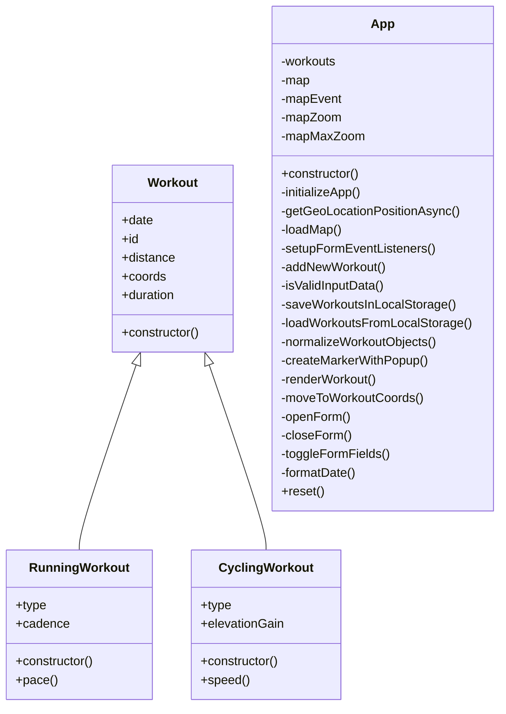

# Mapty – Workout Tracking App

A lightweight workout tracking application built with vanilla HTML, CSS, JavaScript and Leaflet map. Users can log running or cycling workouts directly on an interactive map, with persistent storage via localStorage.

---

````md

````

## Features

- Click on the map to log workouts
- Supports running and cycling activities
- Derived metrics:
    - Running → pace (min/km)
    - Cycling → speed (km/h)
- Interactive map with markers and popups
- Persistent storage using localStorage
- Restore workouts with full class behavior (prototype recovery)
- Smooth navigation to workouts coordinates on map on click
- Reset functionality to clear all data

---

## Tech Stack
- HTML and CSS
- Vanilla JavaScript (ES6+)
- Leaflet.js for maps
- Browser Geolocation API and LocalStorage API

---

## Architecture Highlights

### 1. OOP Design

- Base `Workout` class
- Specialized subclasses:
    - `RunningWorkout`
    - `CyclingWorkout`
- Encapsulation using private fields (`#`)

### 2. State Management

- Centralized in `App` class
- Single source of truth: `#workouts`
- LocalStorage for persistance

### 3. Event-Driven Flow

- Map click → show form
- Form submit → create workout
- List click → move map
- Input change → toggle fields

### 4. Separation of Concerns

- UI rendering isolated (`#renderWorkout`, `#createMarkerWithPopup`)
- Data logic isolated (`#addNewWorkout`, validation, storage)

---

## Run Locally

```bash
git clone <repo>
open index.html
```
